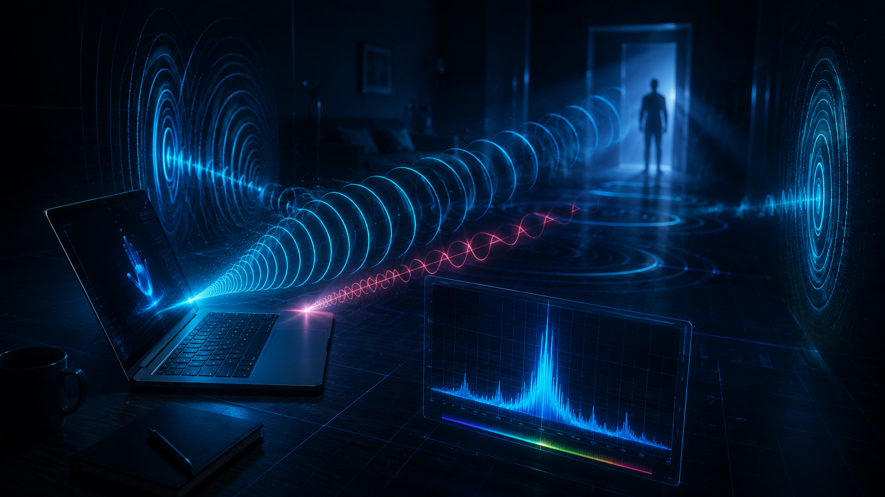

# Specter

**Turn your laptop into a hands-free security system.** This app uses your built-in speakers and microphone as an ultrasonic sonar to detect whether someone is in the room — and auto-locks your PC the moment you walk away.

No cameras. No sensors. No cloud. Just physics.

---

## Why Use This?

| Problem | Solution |
|---|---|
| You walk away from your desk and forget to lock your PC | Auto-locks within seconds of you leaving |
| You don't want to buy extra hardware (motion sensors, IR cameras) | Works with hardware you already have — your laptop's speakers + mic |
| You care about privacy and don't want a camera watching you | Uses inaudible sound waves, not video — nothing to see, nothing to record |
| Corporate security policies require screen lock when unattended | Enforces the policy automatically, no human discipline needed |
| You want something that works offline, no accounts, no subscriptions | Runs 100% locally, zero internet, zero cloud, zero cost |

## What It Does

- Emits an **18kHz ultrasonic chirp** from your speakers every 2 seconds (inaudible to most adults)
- Records the echo via your microphone and analyzes it with **FFT signal processing**
- Detects changes in the echo pattern caused by a person's body reflecting the sound
- Shows a **live floating HUD** with real-time status, confidence score, and energy visualization
- **Auto-locks Windows** when the room has been empty for a configurable duration
- Lives quietly in your **system tray** — green dot = present, red dot = empty

## Use Cases

- **Office workers** — Never leave your desk unlocked again
- **Work-from-home** — Auto-lock when you step away for coffee
- **Shared workspaces** — Protect sensitive data without thinking about it
- **Security-conscious users** — Add a physical-presence layer to your security setup
- **Students** — Keep roommates out of your machine
- **Developers** — A cool signal-processing project to hack on and customize

---

## How It Works



The key insight: an empty room has a consistent echo signature. A person in the room changes it — their body absorbs and reflects sound differently than bare walls. The app calibrates against the empty room and flags any deviation.

---

## Installation

### Prerequisites
- Python 3.11+
- Windows 10/11

### Setup

```bash
# Clone or download this project
cd "Specter"

# Create a virtual environment
python -m venv venv
venv\Scripts\activate

# Install dependencies
pip install -r requirements.txt
```

All dependencies install cleanly via pip — no C compiler required. `sounddevice` bundles the PortAudio binary.

### Quick Launch

Double-click **`run.bat`** to start the app without a console window.

---

## IMPORTANT: Disable Microphone Echo Cancellation

Windows enables echo cancellation on laptop microphones by default. This suppresses speaker audio from reaching the mic — which breaks the sonar approach. **You must disable audio enhancements** before the app will work:

### Method 1: Windows Settings (Windows 11)
1. Open **Settings > System > Sound**
2. Under Input, click your **Microphone**
3. Set **Audio enhancements** to **Off**

### Method 2: Control Panel (works on all Windows versions)
1. Open **Control Panel > Sound** (or run `mmsys.cpl`)
2. Go to the **Recording** tab
3. Right-click your **Microphone** > **Properties**
4. Go to the **Advanced** tab
5. Uncheck **"Enable audio enhancements"**
6. Click **Apply**

The app runs a diagnostic on startup and will show a warning with an "Open Sound Settings" button if echo cancellation is detected.

---

## Usage

```bash
python -m presence_detector.main
```

Or just double-click **`run.bat`**.

### First Launch
1. **Leave the room empty** for 10 seconds while calibration runs
2. The HUD will show "CALIBRATING..." during this phase
3. Once calibrated, the status switches to "PRESENT" or "EMPTY"

### System Tray
- **Left-click** the tray icon to toggle the HUD window
- **Right-click** for the context menu: Show HUD, Recalibrate, Auto-Lock toggle, Quit

### HUD Window
- Drag anywhere to reposition
- Shows real-time status, confidence score, and echo energy bar
- **Recalibrate** button — re-run calibration (leave the room empty)
- **Auto-Lock** checkbox — enable/disable automatic Windows locking

---

## Configuration

All parameters are in `presence_detector/config.py`:

| Parameter | Default | Description |
|---|---|---|
| `CHIRP_FREQ` | 18000 Hz | Ultrasonic chirp frequency |
| `CHIRP_DURATION` | 0.05 s | Chirp burst length (50ms) |
| `SAMPLE_RATE` | 44100 Hz | Audio sample rate |
| `RECORD_DURATION` | 0.20 s | Echo recording window |
| `CYCLE_INTERVAL` | 2.0 s | Time between chirps |
| `BAND_LOW` | 17000 Hz | FFT analysis band lower bound |
| `BAND_HIGH` | 19000 Hz | FFT analysis band upper bound |
| `CALIBRATION_DURATION` | 10.0 s | Calibration phase length |
| `PRESENCE_THRESHOLD` | 2.0 | Std deviations from baseline to trigger |
| `EMPTY_DEBOUNCE_COUNT` | 3 | Consecutive empty readings before confirming |
| `AUTO_LOCK_ENABLED` | True | Auto-lock the PC when empty |
| `LOCK_DELAY_SECONDS` | 0.0 | Extra delay after debounce before locking |

## Frequency Tuning

If 18kHz is audible to you (common for younger people):

1. Open `presence_detector/config.py`
2. Change `CHIRP_FREQ` to `19000` or `20000`
3. Adjust `BAND_LOW` and `BAND_HIGH` accordingly (e.g., `19000`-`21000` for a 20kHz chirp)
4. Recalibrate after changing

**Note:** Higher frequencies may have weaker speaker/mic response on some laptops. If the app warns about low signal, try lowering the frequency instead.

---

## Tech Stack

| Component | Library | Purpose |
|---|---|---|
| Audio I/O | `sounddevice` | Emit chirps, record echoes via PortAudio |
| Signal Processing | `numpy` + `scipy` | FFT analysis, windowing, energy extraction |
| UI | `PyQt6` | System tray icon + floating HUD |
| Windows Lock | `ctypes` | Native `LockWorkStation()` API call |

---

## Troubleshooting

| Issue | Fix |
|---|---|
| "Microphone echo cancellation is active" | Most common issue. See the "Disable Echo Cancellation" section above |
| "No microphone/speaker found" | Check Windows sound settings, ensure devices are enabled and set as default |
| "Very low signal" warning | Your hardware may not respond at 18kHz. Try `CHIRP_FREQ = 16000` |
| False positives | Increase `PRESENCE_THRESHOLD` to 3.0 or 4.0 |
| Slow to detect empty room | Decrease `EMPTY_DEBOUNCE_COUNT` (minimum 1) |
| Locks too quickly | Increase `LOCK_DELAY_SECONDS` (e.g., 10.0 for a 10s grace period) |

---

## How Is This Different From...

| Alternative | Drawback | This App |
|---|---|---|
| PIR motion sensor | Requires extra hardware ($15-50) | Uses existing laptop hardware |
| Webcam-based detection | Privacy concern, CPU-heavy | No video, minimal CPU |
| Bluetooth phone proximity | Drains phone battery, range issues | No phone needed |
| Windows Dynamic Lock | Unreliable, slow (30s+ delay) | Detects in ~6 seconds |
| Manual Win+L habit | Humans forget | Never forgets |

---

## License

MIT License. Use it, modify it, ship it.
